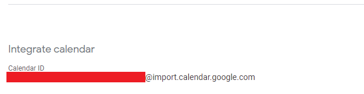

# CalPal
All you need to automate your assignments.

## Schedule assignments around your pre-existing apppointments

### Installation & Setup

1. Clone this repositor
2. ``npm i && cd src/popup && npm i``
3. Compile
  - Build: `npm run build`
  - Develop: `npm run watch`
4. Go to manage extensions at the top right of Google Chrome/chromium
5. Click on `Developer mode` at the top right
6. Load unpacked and select the `dist` directory in this folder

## Google API setup
- Go to https://console.cloud.google.com
- Create a new project
- Go to APIs & Services, and enable a new `Google Calendar API`
- On the left-hand-side, click on credentials, create and copy your OAuth credentials to the manifest.json file's ``"oauth2"`` section

## Usage
- Import a calendar from canvas, using the URL they provide, to your Umail account's Google Calendar.
- Copy the calendar's ID, near the bottom of the settings on the calendar in question, like so:

- Paste the id into the extension's pop-up
