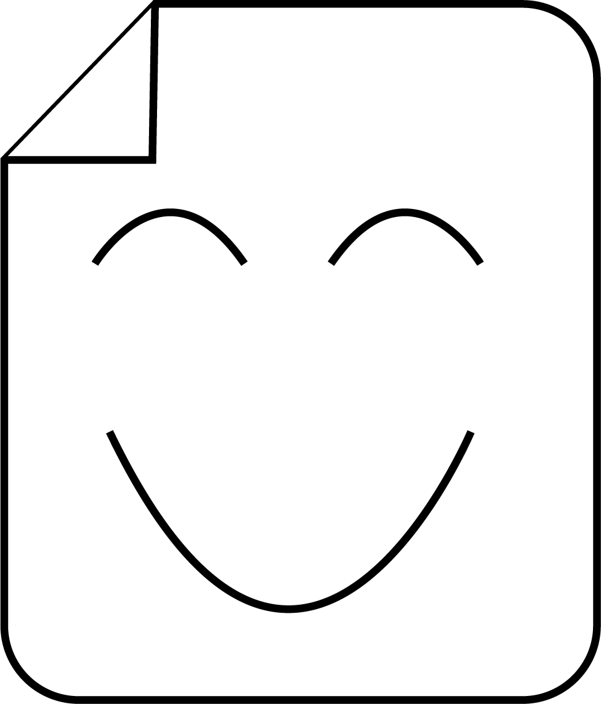
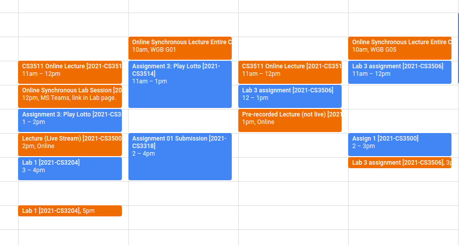

# CalPal
All you need to automate your assignments.

## Schedule assignments around your pre-existing apppointments

### Installation & Setup

1. Clone this repositor
2. ``npm i && cd src/popup && npm i``
3. Compile
  - Build: `npm run build`
  - Develop: `npm run watch`  

## Google API setup
- Go to https://console.cloud.google.com
- Create a new project
- Go to APIs & Services, and enable a new `Google Calendar API`
- On the left-hand-side, click on credentials, create and copy your OAuth credentials to the manifest.json file's ``"oauth2"`` section

### and.... that's all, compile the code with one of the above commands, and you're ready to go
